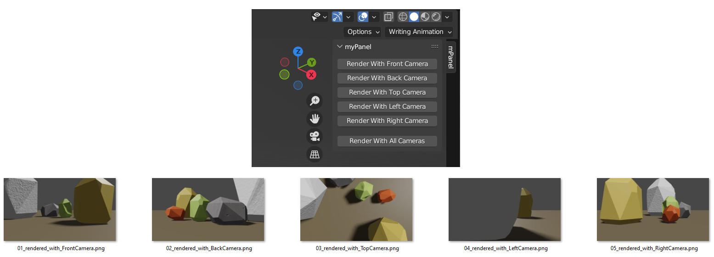

# Camera Rendering Addon

## Overview
Blender addon for easy rendering of the current scene from different points of view

The addon needs to be enabled from the Edit > Preferences menu and will display the custom mPanel in the viewport. The generated images will be placed in the **output** path of the opened **blend** file

